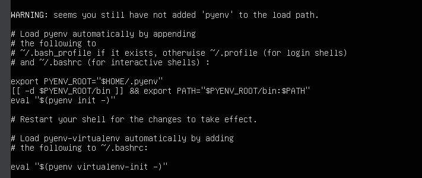

# Configurar OpenMPI com Python no cluster
Referência: https://mpi4py.readthedocs.io/en/stable/install.html

## pyenv
- Instalar o Pyenv para melhor controle das versões do Python (posso usar múltiplas na mesma VM)
```sh
curl https://pyenv.run | bash
```

Referência: [https://github.com/pyenv/pyenv?tab=readme-ov-file#unixmacos](https://github.com/pyenv/pyenv?tab=readme-ov-file#unixmacos)

> Note que após a instalação, ainda tem alguns comandos para você executar para que o pyenv fique no PATH do usuário. Esses comandos você pode adicionar no .profile para que ele seja carregado automaticament no path toda vez que um novo shell for inicializado.



Para checar se tudo deu certo:
```sh
pyenv --version
```

- Ainda, é necessário instalar algumas dependências para que o pyenv possa instalar as versões do Python:

```sh
sudo apt update
sudo apt install \
    build-essential \
    curl \
    libbz2-dev \
    libffi-dev \
    liblzma-dev \
    libncursesw5-dev \
    libreadline-dev \
    libsqlite3-dev \
    libssl-dev \
    libxml2-dev \
    libxmlsec1-dev \
    llvm \
    make \
    tk-dev \
    wget \
    xz-utils \
    zlib1g-dev
```

## Instalar Python

- Instalar usando pyenv
```sh
pyenv install 3.11.8
```

- Configure a versão como a principal do sistema
```sh
pyenv global 3.11.8
```

- Assim você pode chegar todas as versões Python instaladas
```sh
pyenv versions
```

- E assim você pode verificar qual é a versão do Python atualmente ativa
```sh
python --version
```


## Instalar pacotes para Python


- Com este comando você irá instalar o pacote do OpenMPI.
```sh
python -m pip install mpi4py
```

Referência: [https://mpi4py.readthedocs.io/en/stable/install.html](https://mpi4py.readthedocs.io/en/stable/install.html)

- Já o pacote click é utilizado para receber argumentos no python. Uma espécie de cli.

```sh
python -m pip install click
```


## Rodar o código

- Sequencial
```sh
python app.py --mode sequential --until-number 1000
```

- Paralela usando o OpenMPI na mesma máquina
```sh
mpirun -np 3 --machinefile .cluster_hostfile python app.py --mode parallel --until-number 1000
```

- Paralela usando o OpenMPI em todas as VMs do cluster
```sh
mpirun -np 3 python app.py --mode parallel --until-number 1000
```

