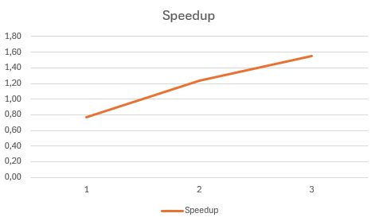

# setrem-parallel-programming

## Index
- [Purpose](#purpose)
- [Development stack](#development-stack)
- [Local testing](#local-testing)
- [Environment for testing](#environment-for-testing)
    - [Running parallel code in the same machine](#running-parallel-code-in-the-same-machine)
    - [Running parallel code in multiple machines](#running-parallel-code-in-multiple-machines)
    - [Running sequential code](#running-sequential-code)
- [Performance tests](#performance-tests)
    - [Speedup](#speedup)
    - [Communication overhead](#communication-overhead)
    - [Full report](#full-report)
- [What is next](#what-is-next)

## Purpose
Given an initial number, the main purpose of this automation is to calculate the quantity of prime numbers in this range.

Example: Given the number 10, the algorithm will return that there are 4 prime numbers until 10.

You can run this algorithm:
- ... in sequential mode
- ... in paralell mode

For parallel mode we are using the farm pattern, which is compose by an emitter, a collector and one or more workers. The emitter organize the work and send tasks to the workers (distributing the tasks evenly). Then, the worker performs the actual work and send the result to collector. Finally, the collector merges this data and presents it to the user.


The main idea of this architecture is to scale the number of workers to achieve more speed. The more workers we have, the higher the performance (in theory). We'll see more about this in the [performance test](#performance-tests).

## Development stack
- Python: 3.11
- Libraries:
    - [mpi4py](https://pypi.org/project/mpi4py/)
    - [click](https://pypi.org/project/click/)
- Dev libraries:
    - [pytest](https://pypi.org/project/pytest/)
    - [coverage](https://pypi.org/project/coverage/)
    - [flake8](https://pypi.org/project/flake8/)

## Local testing

I'm using [pipenv](https://pipenv.pypa.io/en/latest/) to create and manage Python virtual environments. It helps us to isolate the libraries and differents Python versions.

To initialize the virtual environment just run:
```sh
pipenv install -d
pipenv shell
```

To run code using __sequential mode__:
```sh
python app.py --mode sequential --until-number 1000
```

> Where 1000 represents the max number to search for prime numbers.

It's important to comment that to run this code in parallel mode I'm using [OpenMPI](https://www.open-mpi.org/). In case you are using Windows in your development environment, even if you will run this code in sequential mode, you must [install Microsoft MPI](https://learn.microsoft.com/en-us/message-passing-interface/microsoft-mpi). If you don't, a common error that may happen is:
```
ImportError: DLL load failed while importing MPI: Não foi possível encontrar o módulo especificado.
```


## Environment for testing

To run this code in a testing environment, we first need to create this environment following [these steps](./.docs/ENVIRONMENT.md).

The next steps, you must run just on __primary__.

You must access the shared folder and clone this repository:
```sh
cd /home/mpihpc/shared
git clone https://github.com/gabrielrih/setrem-parallel-programming.git
```

Then you can finally run the code inside the repo:
```sh
cd setrem-parallel-programming
```

### Running parallel code in the same machine

Running the code in the same machine:
```sh
mpirun -np 3 python app.py --mode parallel --until-number 10000
```

> Note that in this case the _mpirun_ are running the code in three different processes but all of them in the same machine. Another important thing is that each process is created in a differente vCore, so, in this case, the VM must have three or more vCores.


### Running parallel code in multiple machines

Running the code in multiple machines:
```sh
mpirun -np 3 --machinefile /home/mpihpc/.cluster_hostfile python app.py --mode parallel --until-number 10000
```

> Note that in this case the _mpirun_ are running using three different processes. By default, each process are allocated in a different vCore. If the -np value is bigger than the number of vCores in all the cluster, the default behavior is generate an error.

### Running sequential code

Running the sequential code. It uses just a single vCore.
```sh
python app.py --mode sequential --until-number 10000
```

## Performance tests

I ran performance tests using the sequential and the parallel mode. All the tests were performed on the __primary__ node in the testing environment previously created.

In theory, if the process took 10 seconds to run in sequential mode, if you have two processes it would take half of that, which is 5 seconds; if you have three processes it would take one third of that, 3.3 seconds; and so one and so far. But, in real world it's not posible for many reasons. One of them is that not all of your code is parallel, there would always be some parts that will continue runinng sequentially. Other reasons could be hardware limitation, memory usage, networking and more.

### Speedup
When you run a code sequentially, using a single vCore, it would take an amount of time to finish it. When you run your code in parallel, using two or more vCores, it would probably take a different amount of time. The division by this two times will generates the speedup ([click here for more details](https://en.wikipedia.org/wiki/Amdahl%27s_law)).

$$ S = {T(1) \over T(N)} $$

> Where T(1) is the amount of time it takes to run sequentially and T(N) is the amount of time is takes to run in parallel (N is the number of vCores used).

The speedup graphic is normally presents by vCores, however, using the farm pattern, two of the vCores are used by emitter and collector and it does not have parallel code. This way, it makes more sense to generate the graphic by the number os workers and not the total of vCores used. In a simple example, if it's using four vCores, just two of them would be workers (parallel code).

The tests were divided into three categories and the same test in each category was ran five times.
- The first category was to generate prime numbers until 30,000.
- The second, until 50,000.
- And the last one, until 100,000.

Them, I calculate the average of time it took in each category and them I calculated the speedup in each category using this average time.

The final speedup was the average of speedup in all categories.



As you can see in the graphic, when I used just a single worker, in fact the speedup was less than one. It means, using a single worker it is slower than running it in sequential mode. In fact, it was surprising for me, because I thought the division of work between emitter, collector and worker, would be enough to improve the performance. The reason of that probably is the comunication overhead and the complex code.

However, from two workers the performance is improved by 24%. And using three workers the performance gets even better, 55%. This is really interesting because we are increasing the number of workers and the performance increases more and more. It would be also interesting to calculate the limitation of this approach, which means, what is the maximum of workers I can have where performance still increases? Note that probably in a certain number of workers the performance would not increase, so this is the maximum scalability you can have (more than that you would probably have to improve the code or scale horizontally).

### Communication overhead
It's important also comment about communication overhead. The OpenMPI protocol has to establish communication between the processes (emitter, collector and workers). And obviously there is a cost to do that. The first version of the code, I was sending the data from emitter to worker one by one. Using this strategy the parallel code was 30% slower than the sequential mode even using three workers (5 vCores in total). To solve this, I changed this logic to send data in batches of 50 instead of sending one by one. It decrease the communication overhead in 50% and them the parallel code finally took some advantage comparing to the sequential one.

See [paralle.py file](./src/prime/parallel.py) for more details.

### Full report
To access the full tests result, we can look at [performance_tests.xlsx](./.docs/performance_test.xlsx).

## What is next
To finish, there are some aproaches and changes I could try in the future to improve the performance of the parallel code even more:
- __Change the batch size__: I ran tests just using the batch value of 50. But, if I try changing this values, maybe the performance would be even better.
- __Received data by collector__: The collector class received every single response from workers. So, if the until_number is 100,000, the collector would receive 100,000 responses from workers. However, the collector just need to know the prime numbers, so, if we change this logic to collector receive just the prime numbers, probably we'll have a lot of difference in the performance. This is because the quantity of exchange messages would be drastically reduced.
- __Horizontal scaling__: The performance test was ran just in a single machine. It's a good idea to test it in a cluster of nodes. I thought probably the performance for few work (few numbers) would be worst that running in a single machine, however, maybe, using higher numbers the performance would be better.

