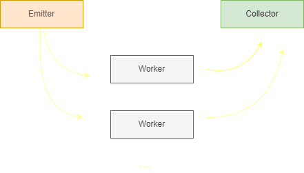

# setrem-parallel-programming

## Index
- [Purpose](#purpose)
- [Development stack](#development-stack)
- [Architecture](#architecture)
- [Local testing](#local-testing)
- [Environment for testing](#environment-for-testing)
    - [Running parallel code in the same machine](#running-parallel-code-in-the-same-machine)
    - [Running parallel code in multiple machines](#running-parallel-code-in-multiple-machines)
    - [Running sequential code](#running-sequential-code)
- [Other things](#other-things)

## Purpose
The main purpose is, given an initial number, calculate the quantity of prime numbers in this range.

Example: Given the number 10, the algorithm will return that there are 4 prime numbers until 10.

You can run this algorithm:
- ... in sequential mode
- ... in paralell mode


## Development stack
- Python: 3.11
- Libraries:
    - [mpi4py](https://pypi.org/project/mpi4py/)
    - [click](https://pypi.org/project/click/)


## Architecture

We are using the farm pattern.



## Local testing

I'm using [pipenv](https://pipenv.pypa.io/en/latest/) to create and manage Python virtual environments. It helps us to isolate the libraries and differents Python versions.

To initialize the virtual environment:
```sh
pipenv install -d
pipenv shell
```

To run code using __sequential mode__:
```sh
python app.py --mode sequential --until-number 1000
```

> Where 1000 represents the max number to look for prime numbers.

It's important to comment that to run this code in parallel mode I'm using [OpenMPI](https://www.open-mpi.org/). In case you are using Windows in your development environment, to avoid error you must [install Microsoft MPI](https://learn.microsoft.com/en-us/message-passing-interface/microsoft-mpi). A common error that happen here is:
```
ImportError: DLL load failed while importing MPI: Não foi possível encontrar o módulo especificado.
```


## Environment for testing

To run this code in a testing environment, we must create this environment. So, before everything just create this environment following [these steps](./ENVIRONMENT.md).

The next steps you must run on __primary__.

You must access the shared folder and clone this repository:
```sh
cd /home/mpihpc/shared
git clone https://github.com/gabrielrih/setrem-parallel-programming.git
```

Then you can finally run the code inside the repo:
```sh
cd setrem-parallel-programming
```

### Running parallel code in the same machine

Running the code in the same machine:
```sh
mpirun -np 3 python app.py --mode parallel --until-number 10000
```

> Note that in this case the _mpirun_ are running the code in three different processes but all of them in the same machine. Another important thing is that each process is created in a differente vCore, so, in the case, the VM must have thre or more vCores.


### Running parallel code in multiple machines

Running the code in multiple machines:
```sh
mpirun -np 3 --machinefile /home/mpihpc/.cluster_hostfile python app.py --mode parallel --until-number 10000
```

> Note that in this case the _mpirun_ are running using three different processes. By default, each process are allocated in a different vCore. If the -np value is bigger than the number of vCores in all the cluster, the default behavior is to generate an error.

### Running sequential code

Running the sequential code. It uses just a single vCore.
```sh
python app.py --mode sequential --until-number 10000
```

## Other things
[Here](./cpp/CPP.md) you can see some example using C++.