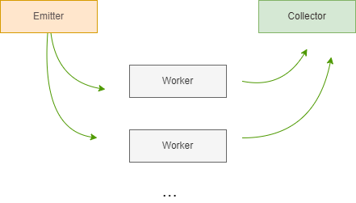

# setrem-parallel-programming

## Index
- [Purpose](#purpose)
- [Development stack](#development-stack)
- [Architecture](#architecture)
- [Local testing](#local-testing)
- [Environment testing](#environment-testing)
    - [Running parallel code in the same machine](#running-parallel-code-in-the-same-machine)
    - [Running parallel code in multiple machines](#running-parallel-code-in-multiple-machines)
    - [Running sequential code](#running-sequential-code)
- [Other things](#other-things)

## Purpose
O propósito principal deste repositório é implementar um algoritmo que, dado um número inicial, retorna a quantidade de números primes neste intervalo.

Exemplo: Dados o número 10, o algoritmo irá retornar que existem 4 números primos até o número 10.

Este algoritmo possui duas vertentes:
- Executar de forma sequencial.
- Executar o código de forma paralela.


## Development stack
- Python: 3.11
- Bibliotecas:
    - [mpi4py](https://pypi.org/project/mpi4py/)
    - [click](https://pypi.org/project/click/)


## Architecture

We are using the farm pattern.



## Local testing

Para testes locais estou utilizando basicamente o [pipenv](https://pipenv.pypa.io/en/latest/) para gerar e controlar ambientes virtuais Python de forma isolada (sem necessidade de instalar bibliotecas diretamente na minha máquina).

Para inicializar o ambiente virtual basta executar:
```sh
pipenv install -d
pipenv shell
```

Para executar o código de forma __sequencial__ execute:
```sh
python app.py --mode sequential --until-number 1000
```

> Onde 1000 representa até que número devemos procurar pelos números primos

Importante comentar que para o teste paralelo é necessário utilizar o [OpenMPI](https://www.open-mpi.org/) e caso você esteja utilizando Windows para desenvolver o OpenMPI não irá funcionar, portanto, o teste local somente funciona com o código sequencial. Contudo, mesmo em ambiente Windows é necessário [instalar o Microsoft MPI](https://learn.microsoft.com/en-us/message-passing-interface/microsoft-mpi) para evitar erros do Python para a biblioteca mpi4py.

Um erro bastante comum é:
```
ImportError: DLL load failed while importing MPI: Não foi possível encontrar o módulo especificado.
```


## Environment testing

Antes de mais nada o ambiente controlado deve ser provisionado. Para mais detalhes das tecnologias utilizadas e de como o ambiente foi configurado você pode [clicar aqui](./OPEN_MPI.md).

A partir daqui, tudo será feito no __primary__.

You must access the shared folder and clone this repository:
```sh
cd /home/mpihpc/shared
git clone https://github.com/gabrielrih/setrem-parallel-programming.git
```

Then you can finally run the code inside the repo:
```sh
cd setrem-parallel-programming
```

### Running parallel code in the same machine

Running the code in the same machine:
```sh
mpirun -np 3 python app.py --mode parallel --until-number 10000
```

> Note that in this case the _mpirun_ are running the code in three different processes but all of them in the same machine. Another important thing is that each process is created in a differente vCore, so, in the case, the VM must have thre or more vCores.


### Running parallel code in multiple machines

Running the code in multiple machines:
```sh
mpirun -np 3 --machinefile /home/mpihpc/.cluster_hostfile python app.py --mode parallel --until-number 10000
```

> Note that in this case the _mpirun_ are running using three different processes. By default, each process are allocated in a different vCore. If the -np value is bigger than the number of vCores in all the cluster, the default behavior is to generate an error.

### Running sequential code

Running the sequential code. It uses just a single vCore.
```sh
python app.py --mode sequential --until-number 10000
```

## Other things
[Here](./cpp/CPP.md) you can see some example using C++.