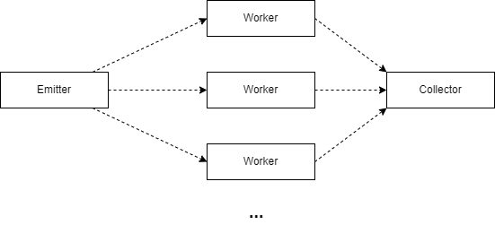

# Exercise using the Farm Pattern

In this exercise, we are using OpenMPI in C++ to create a simple example of the farm pattern.

## Architecture


## To compile and run the code
```sh
./compile_and_run.sh
```

> You can set has parameters the number of processes (limited to the maximum of vCores in the cluster)

## References
- [Farm pattern]()
- [OpenMPI]()